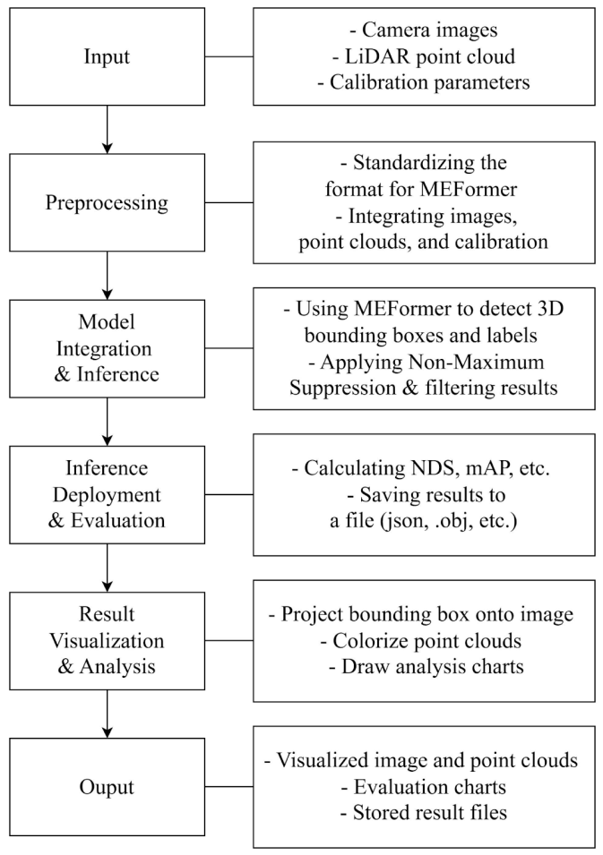
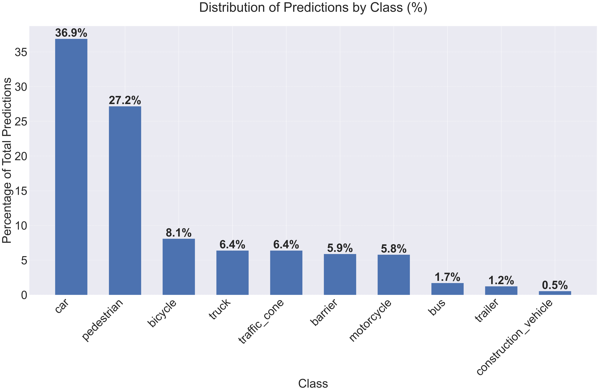
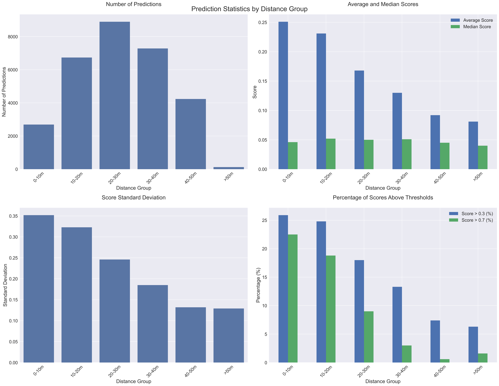
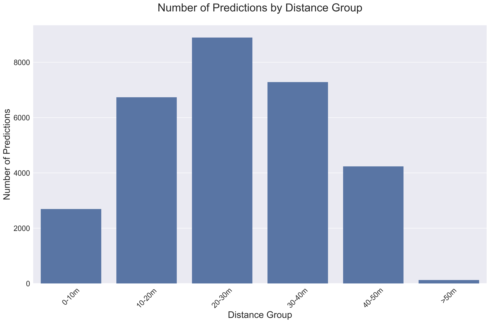
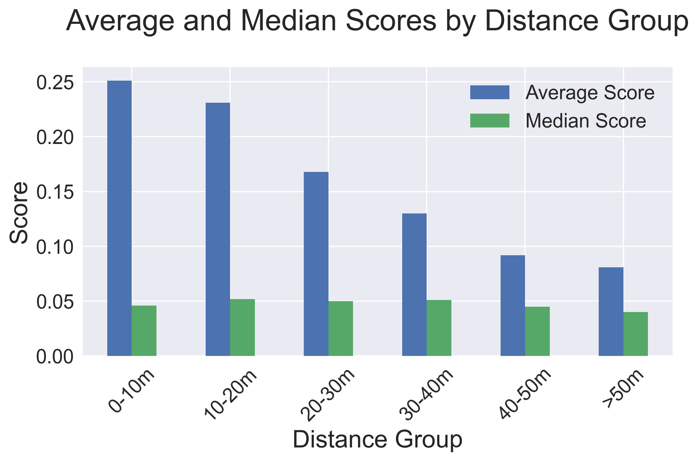
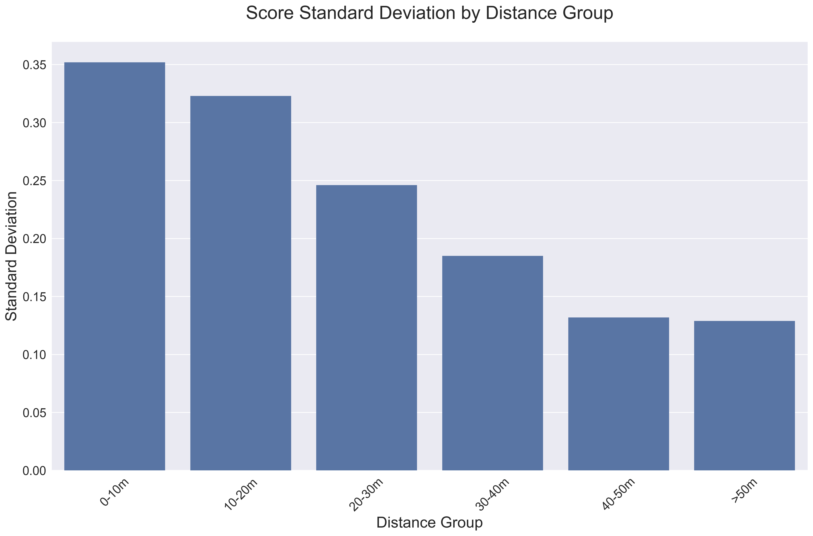
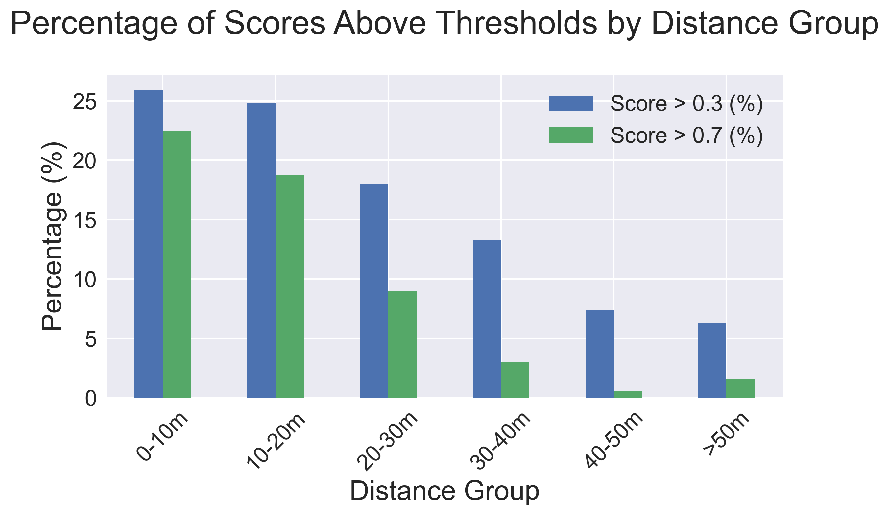

# Development of a Multimodal 3D Object Recognition and Visualization System for Traffic Environments Using Camera-LiDAR Fusion

## Overview
This project develops a multimodal 3D object recognition and visualization system for traffic environments using camera and LiDAR data. The system integrates the MEFormer model within the MMDetection3D framework to perform 3D object detection on the nuScenes dataset and provides visualization tools for analyzing detection results from both 2D camera images and 3D LiDAR point clouds.

## Objectives
- Develop a pipeline for multimodal 3D object detection using camera and LiDAR data.
- Integrate and evaluate the MEFormer model within the MMDetection3D framework.
- Process and evaluate detection results using the nuScenes dataset and standard 3D detection metrics.
- Develop a visualization application for inspecting camera images, LiDAR point clouds, and 3D bounding boxes.

## System Pipeline


## Methodology

This project implements a multimodal 3D object detection and visualization pipeline based on the MEFormer model within the MMDetection3D framework.

### Sensor Fusion

The system combines camera images and LiDAR point clouds to exploit their complementary information. Camera data provides rich semantic and visual information, while LiDAR provides direct spatial and depth information for 3D scene understanding.

### Model Integration

MEFormer is integrated into the MMDetection3D framework to process multimodal camera and LiDAR data for 3D object detection. The workflow includes data preparation, format standardization, model inference, result processing, and evaluation.

### Data Processing and Inference

The input data is preprocessed and synchronized using the calibration and metadata provided by the nuScenes dataset. Camera images, LiDAR point clouds, and related annotations are converted into the formats required by the detection pipeline before inference.

### Result Visualization

A Python-based visualization application was developed to inspect the detection results from both camera and LiDAR views. The application supports 2D image visualization, 3D point-cloud visualization, bounding-box display, result analysis, and export of processed outputs.

## Dataset

The project uses the **nuScenes dataset** as the benchmark for multimodal 3D object detection. For the experimental evaluation, the **nuScenes mini** dataset was used as a compact subset suitable for research under limited computational resources.

| Item | Details |
|---|---|
| Dataset | nuScenes mini |
| Scenes | 10 |
| Camera | 6 views |
| LiDAR | 1 sensor |
| Radar | 5 sensors |
| Task | Multimodal 3D object detection |
| Model | MEFormer |
| Framework | MMDetection3D |

For the experimental evaluation, four scenes were selected:

- Scene 0103
- Scene 0916
- Scene 0796
- Scene 0553

The project focuses on **camera and LiDAR data** for multimodal 3D object detection, while the additional sensor information available in nuScenes provides broader dataset context.

## Implementation

The system is implemented in Python and built around the MMDetection3D framework. The workflow covers dataset preparation, sensor-data preprocessing, MEFormer inference, result standardization, evaluation, and visualization.

The visualization application is developed with PyQt5 and Open3D, providing synchronized views of camera images and 3D LiDAR point clouds. OpenCV and NumPy are used for image processing and numerical operations.

## Results

The distance-based analysis was performed on 29,975 predicted objects across 162 samples.
```md
### Detection Performance

| Metric | nuScenes Full | nuScenes Mini |
|---|---:|---:|
| NDS | 0.74 | 0.72 |
| mAP | 0.72 | 0.72 |
| mATE | 0.27 | 0.27 |
| mASE | 0.24 | 0.31 |
| mAOE | 0.30 | 0.21 |
| mAVE | 0.27 | 0.36 |
| mAAE | 0.11 | 0.33 |
```
### Distance Distribution

| Distance Group | Predictions |
|---|---:|
| 0–10 m | 2,694 |
| 10–20 m | 6,737 |
| 20–30 m | 8,896 |
| 30–40 m | 7,284 |
| 40–50 m | 4,237 |
| >50 m | 127 |

## Visualization

The project provides visual analysis of multimodal 3D detection results from both camera images and LiDAR point clouds.

### Prediction Class Distribution



### Distance-based Analysis



The analysis further examines prediction performance across different object-distance ranges, including prediction counts, confidence scores, score variation, and confidence thresholds.

### Distance Group Analysis









## Limitations

- The project relies on the computational resources available during development, which limits large-scale experimentation.
- Detection performance can decrease for small, distant, or partially occluded objects.
- Multimodal performance depends on accurate sensor calibration and data synchronization.
- The current implementation focuses on camera-LiDAR fusion and does not fully integrate additional sensors such as radar or GPS into the detection pipeline.

## Future Development

- Collect and evaluate real-world camera and LiDAR data for deployment-oriented testing.
- Improve robustness for small, distant, and difficult-to-detect objects through targeted data augmentation.
- Explore application-specific confidence and distance thresholds for traffic-scene analysis.
- Extend the system toward broader multimodal sensing and real-time deployment on vehicle platforms.

## Requirements

The project was developed and tested with the following environment:

| Component | Version / Configuration |
|---|---|
| Python | 3.8 |
| PyQt5 | 5.15.0 |
| Open3D | 0.17.0 |
| OpenCV | 4.7.0 |
| NumPy | 1.23.0 |
| Framework | MMDetection3D |

## Usage

### 1. Prepare the environment

Install the required Python packages and configure the MMDetection3D environment according to the project setup.

### 2. Prepare the dataset

Obtain the required nuScenes dataset and place the necessary files according to the structure described in [`input/README.md`](./input/README.md).

### 3. Analyze detection results

Run the analysis script from the project root:

```bash
python src/analyze_distance_performance.py
```

## Project Structure

```text
LiDAR-Camera-Fusion-Graduation-Project/
├── docs/
│   └── pipeline.png
├── input/
│   └── README.md
├── output/
│   ├── results_nusc.json
│   ├── distance_statistics.csv
│   ├── class_distribution.csv
│   └── visualizations/
│       ├── class_distribution.png
│       ├── distance_statistics_combined.png
│       ├── distance_statistics_count.png
│       ├── distance_statistics_scores.png
│       ├── distance_statistics_std.png
│       └── distance_statistics_thresholds.png
├── report/
│   ├── Graduation_Thesis.pdf
│   ├── Presentation.pdf
│   └── README.md
├── src/
│   └── analyze_distance_performance.py
├── LICENSE
└── README.md
```
## Thesis
The complete graduation thesis and project presentation are available in the [`report`](./report) directory.

- [Graduation Thesis](./report/Graduation_Thesis.pdf)
- [Project Presentation](./report/Presentation.pdf)
